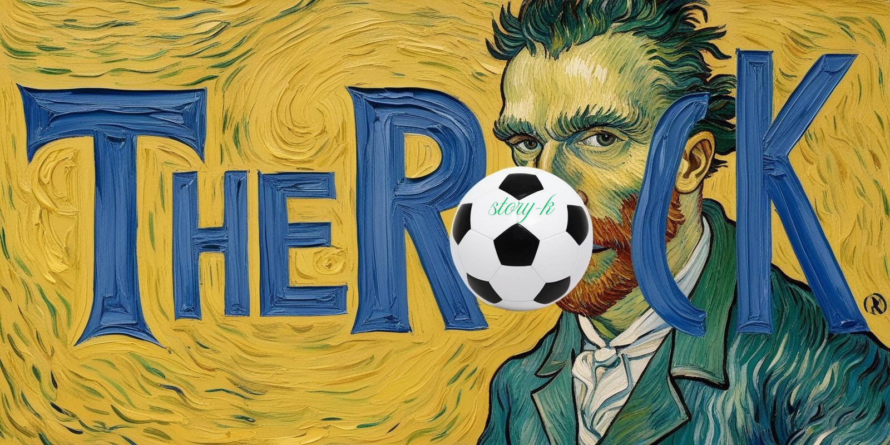

<!-- ## Hi there 👋 -->

<!--
**RockFilm/RockFilm** is a ✨ _special_ ✨ repository because its `README.md` (this file) appears on your GitHub profile.

Here are some ideas to get you started:

- 🔭 I’m currently working on ...
- 🌱 I’m currently learning ...
- 👯 I’m looking to collaborate on ...
- 🤔 I’m looking for help with ...
- 💬 Ask me about ...
- 📫 How to reach me: ...
- 😄 Pronouns: ...
- ⚡ Fun fact: ...
-->

<h1> Hi, I'm TheRock.
<!--  -->
</h1>

  <em>
    <h3>
    Content Creator at
      <a href="https://www.youtube.com/">
        Film by TheRock 
      </a>
    </h3>
  </em>
  <em>
  <h3>
    Instructor at 
    <a href="https://블라.com/">
      RockFilm
      
    </a>
  </h3>
    </em>
  </em>

 
<h2> My tech stack 📚 </h2>

 
<!-- 
<h2>My popular videos</h2>
<table>
  <tbody>
    <tr>
      <td>
        
      </td>
      <td>
        
      </td>
      <td>
        
      </td>
    </tr>
  </tbody>
</table>
<b><em><a href="https://www.youtube.com/">More videos...</a></em></b>
-->
